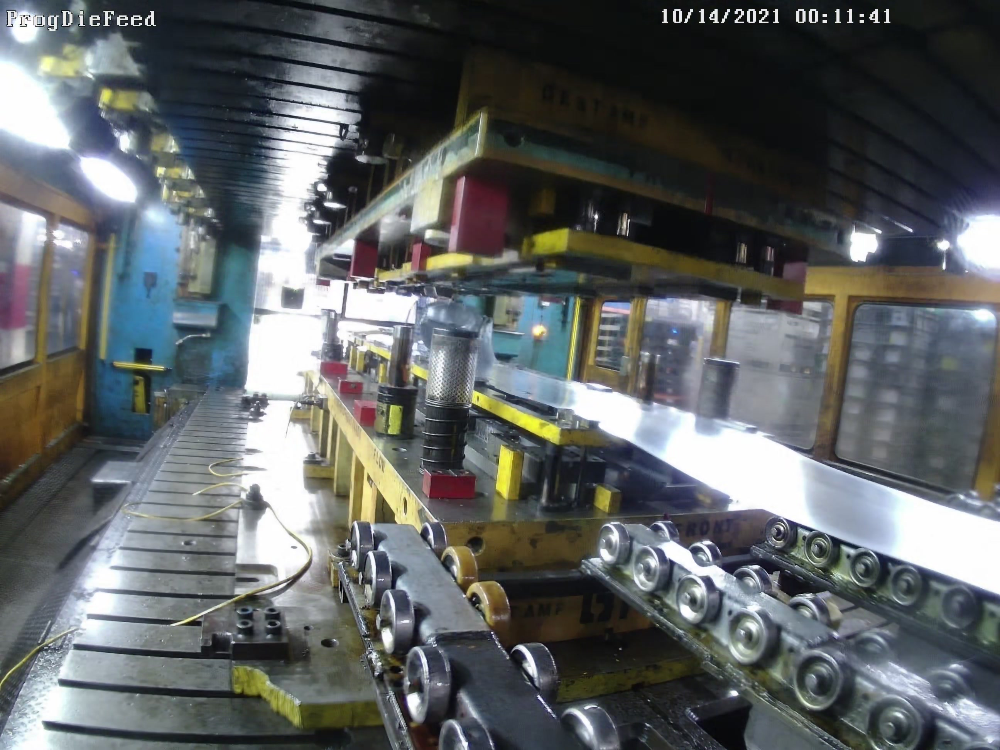
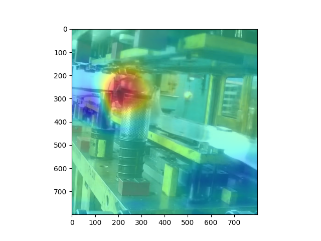

# factorio

Trained a simple binary classifier on frames taken from `ProgDieFeed_20211014000000.avi` video.
MCC score of .97 on test set (test set is the images the model never gets to see during training)

And below is an example from the test set where the model was 99.8% sure that it would be a good time to hit the e-stop.
The first image is the original extracted frame from the video, second image is class activation mapping (where the model is paying attention to the most in the image) of that frame.

